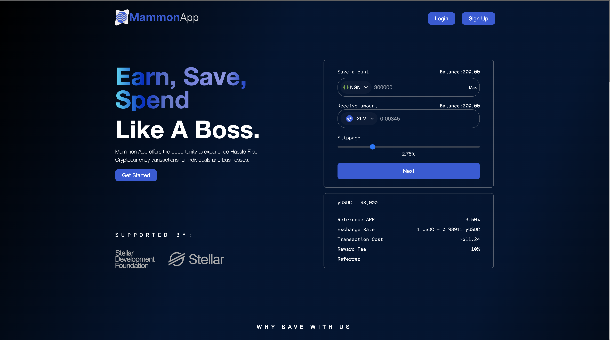

# Mammon App Frontend



## Overview
The **Mammon App Frontend** is a web application built using **Next.js**, providing a seamless and interactive user experience. 
This project serves as the front-facing interface of the Mammon platform, enabling users to interact with its various financial and trading features.

## Features
- Built with **Next.js** for optimized performance and SEO benefits.
- Responsive design for a seamless experience on all devices.
- Secure API integrations for data retrieval and transactions.
- Real-time updates for financial and trading activities.
- Dynamic UI components enhancing user engagement.

---

## Problem Statement

Despite the increasing adoption of cryptocurrency for cross-border payments, the lack of reliable crypto-to-fiat and fiat-to-crypto 
conversion mechanisms remains a major challenge to users eg in Nigeria and West Africa.

Many users rely on informal peer-to-peer (P2P) trading and physical brokers, which often result in:

- **Scams and unreliable transactions**
- **High fees and inflated exchange rates**
- **Slow transaction processing**
- **Regulatory uncertainties affecting liquidity**

The **Mammon App** aims to solve this problem by providing a secure, fast, and user-friendly platform that allows users to seamlessly 
convert and transact between crypto and fiat currencies using **Stellar blockchain technology**.

---

## Technical Architecture

The Mammon App frontend is built on a modern, scalable architecture, ensuring high performance, security, and a great user experience.

### **Tech Stack**

- **Next.js** – Server-side rendering and static site generation for optimal performance
- **React.js** – Component-based UI design
- **Tailwind CSS** – Modern styling for responsive and dynamic interfaces
- **TypeScript** – Ensures type safety and maintainability
- **Redux Toolkit** – State management for API calls and user data
- **Axios** – Handles HTTP requests to the Mammon Backend API
- **WebSockets** – Provides real-time updates for transactions and notifications

### **Key Features**

- Secure authentication (JWT-based login system)
- User dashboard for transaction management
- Real-time exchange rate updates
- Crypto-to-fiat and fiat-to-crypto conversion interface
- Swap, Withdraw and Deposit for both Crypto and Fiat (Bridging Crypto to Fiat and Fiat to Crypto)

The frontend interacts with the **Mammon Backend API**, which handles wallet management, **Stellar blockchain interactions**, and **fiat on-ramp/off-ramp transactions**.

---

## Justification for Technical Decisions

- **Next.js** was chosen due to its **server-side rendering (SSR) and static site generation (SSG)**, optimizing performance for real-time financial applications.
- **TypeScript** ensures a robust and error-free codebase, reducing potential issues in production.
- **Tailwind CSS** enables rapid UI development and maintains design consistency.
- Good **state management**, making API data handling more efficient.
- Given the **sensitive nature of financial transactions**, secure API communication and authentication measures (**JWT and HTTPS**) are implemented to prevent unauthorized access.

---

## Team’s Experience with Stellar Development

Our team has extensive experience in building **blockchain-powered financial applications**. We have worked with **Stellar's APIs and SDKs**, integrating:

- **Anchor services** for seamless fiat on/off-ramp transactions
- **SEP-24** deposits/withdrawals
- **Stellar Decentralized Exchange (SDEX)** for liquidity and trading


## Getting Started
Follow the steps below to set up and run the Mammon App Frontend locally.

### Prerequisites
Ensure you have the following installed:
- **Node.js** (LTS version recommended)
- **npm** or **yarn** package manager

### Installation
Clone the repository and install dependencies:
```bash
# Clone the repository
git clone https://github.com/mammon-app/frontend.git
cd mammon-frontend

# Install dependencies
npm install  # or yarn install
```

### Environment Variables
Create a `.env` file in the root directory if you have none and add the required environment variables. 

Below is a list of environment variables and their explanations that should be included in your `.env` file:

- **NEXT_PUBLIC_BASE_URL**: The base URL of your backend API, used for making API calls. It should point to the backend server and its API endpoint (e.g., `http://localhost:{BACKEND_PORT}/api/mammonapp`).
  
- **NEXT_PUBLIC_API_KEY**: The API key required to authenticate and interact with the backend. It is essential for secure API communication between the frontend and backend.

Make sure to replace `{BACKEND_PORT}` with the actual port number that your backend service is running on, and replace `Your backend API key` with the actual API key you obtained from your backend setup.

### Running the Project
Before starting the application, make sure:
- You have added the correct `.env` content.
- All dependencies are installed.
- If using a local backend, make sure the backend service is running to enable API calls.

To build and start the project, run the following commands:
```bash
# Build the project
npm run build  # or yarn build

# Start the application
npm start  # or yarn start
```

The application will be available at: [http://localhost:3000](http://localhost:3000)